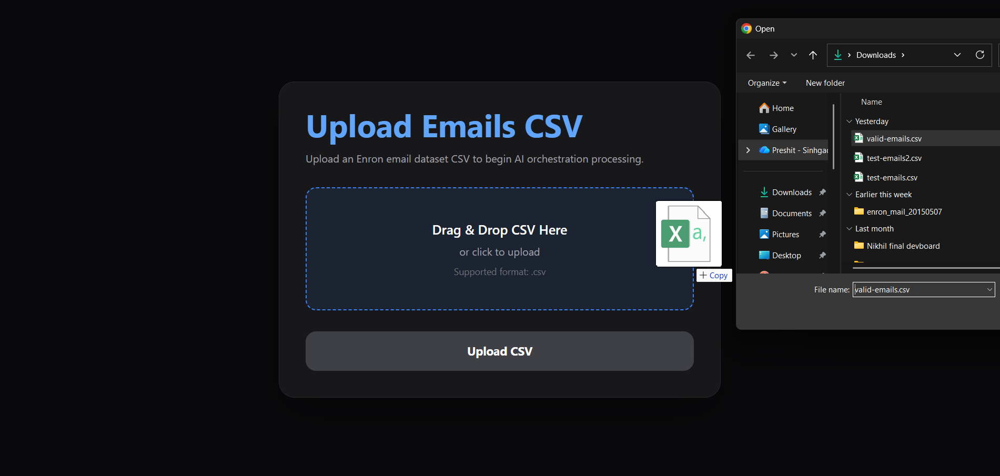
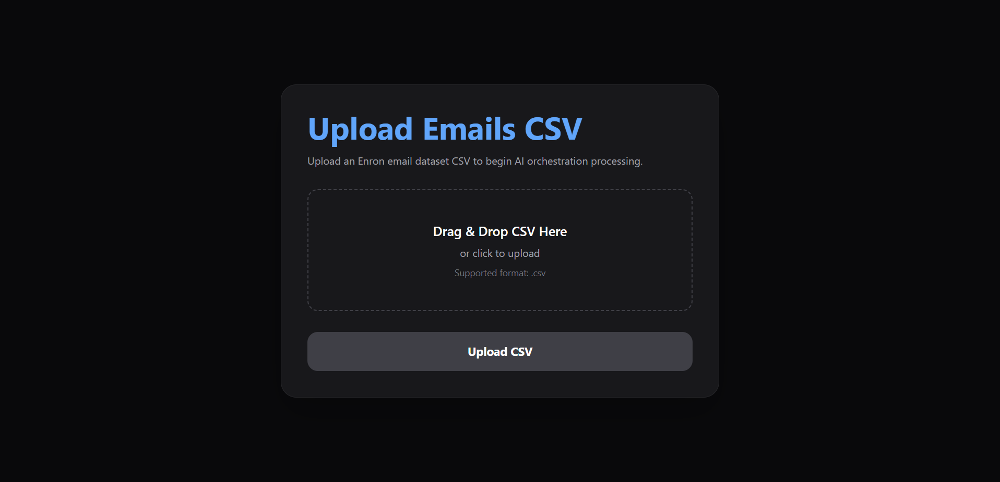
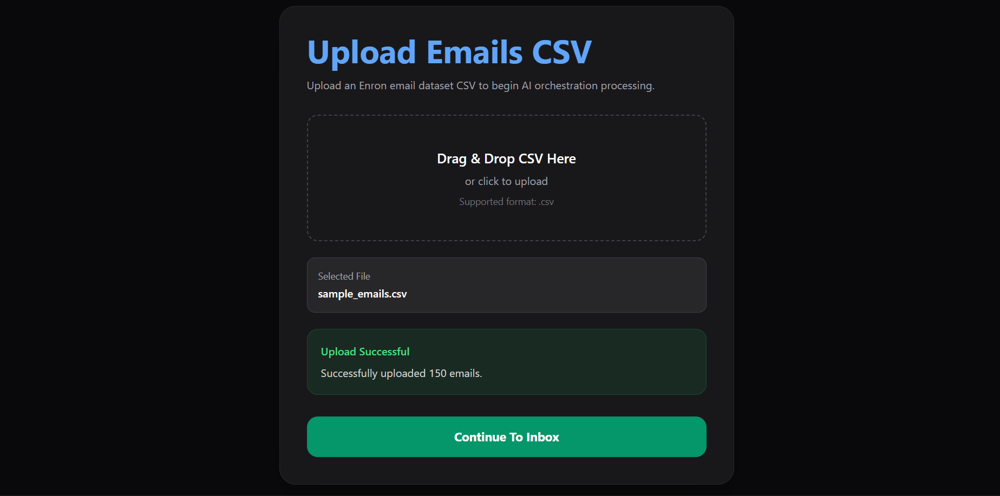
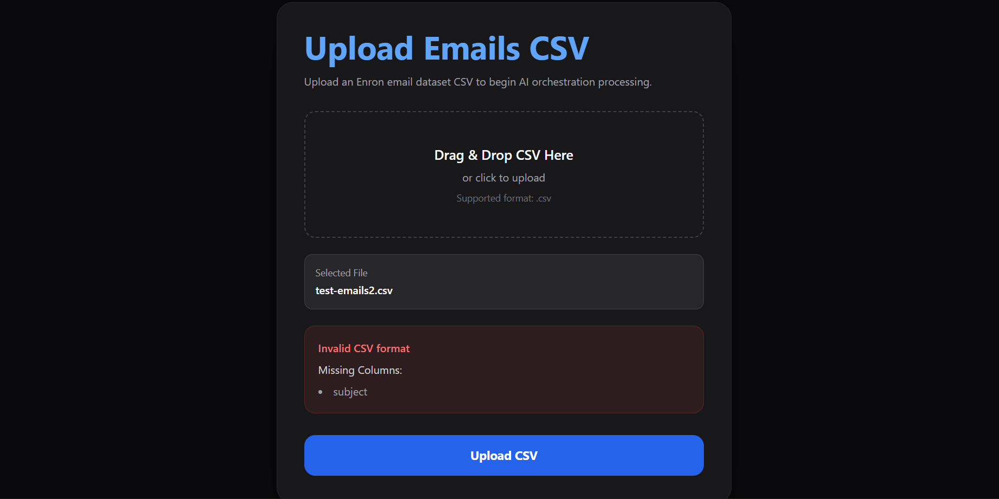
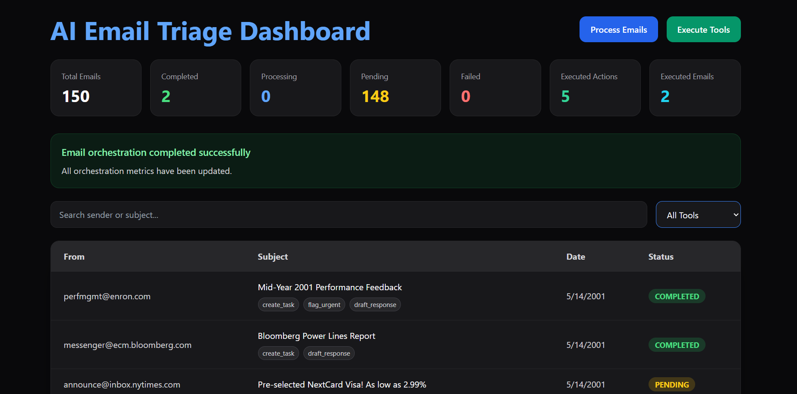
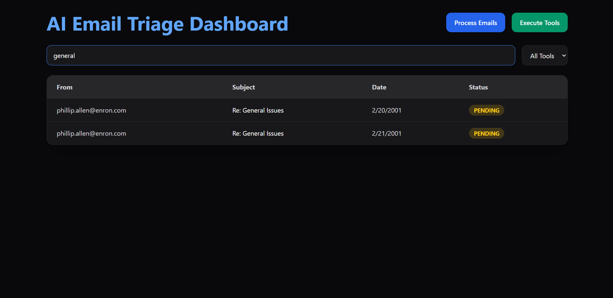
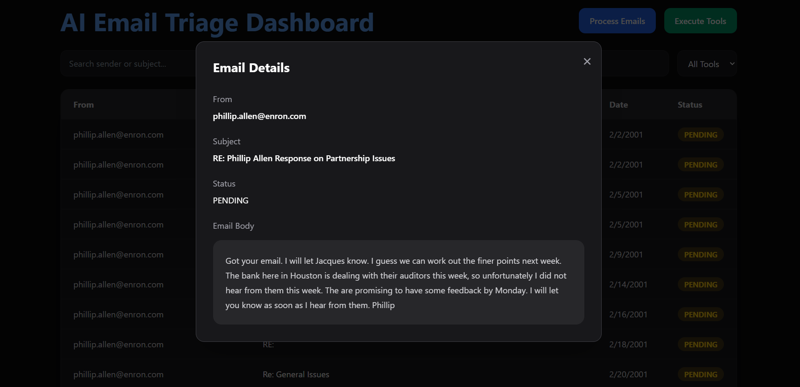
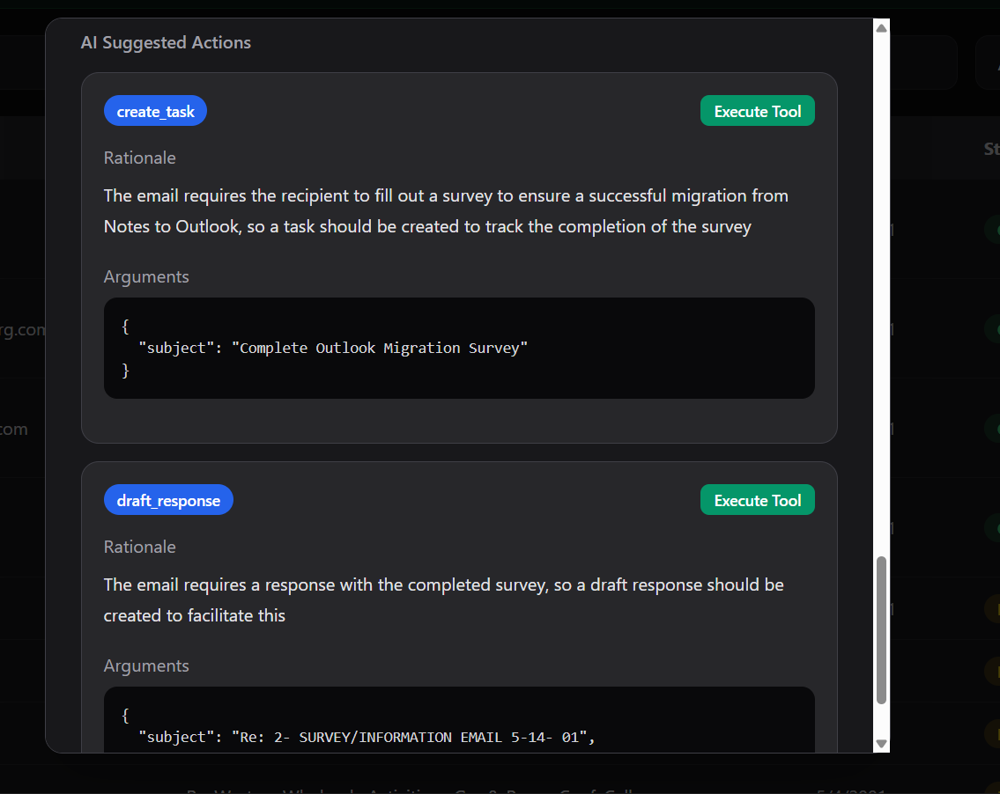
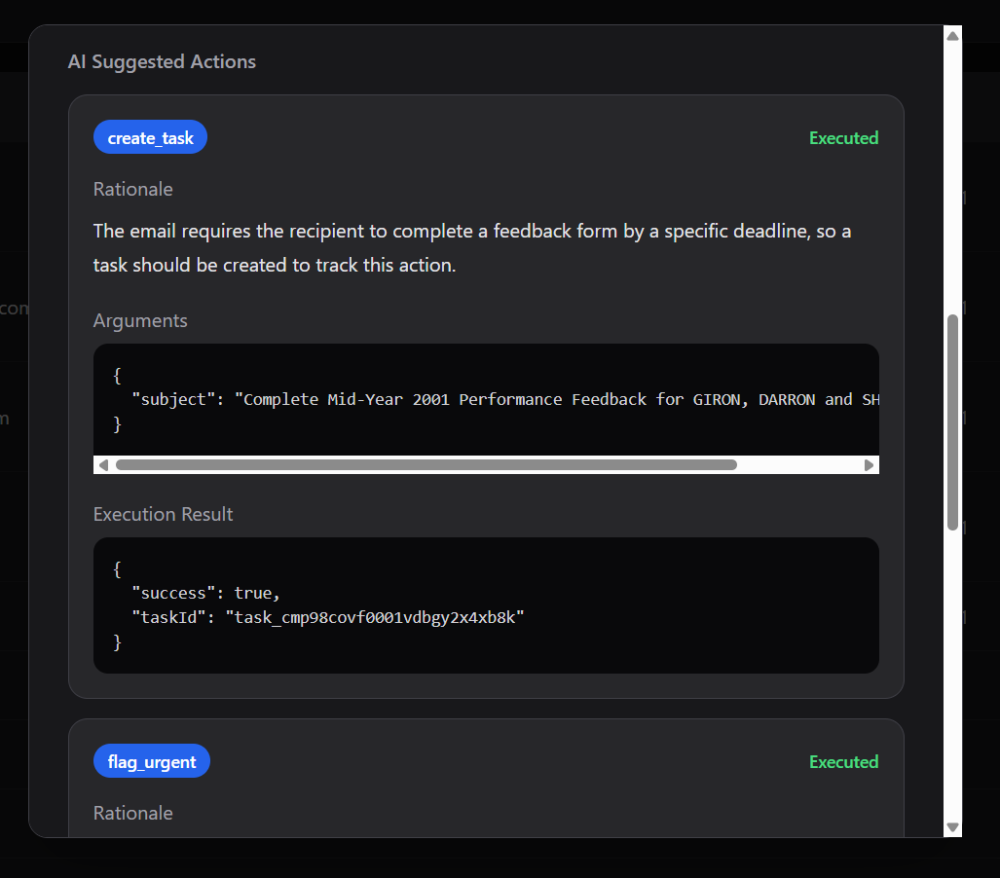
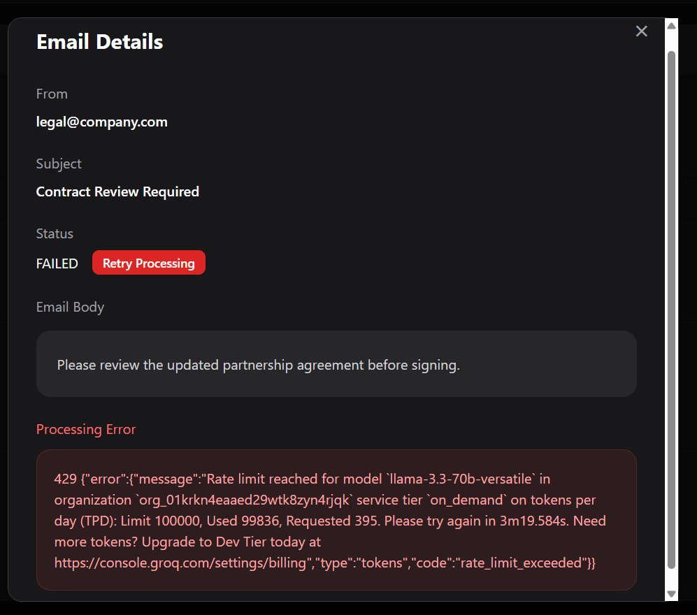

# AI Email Triage Assistant

# Live Demo

Frontend:
https://ai-email-triage-assistant-frontend.vercel.app

Backend API:
https://ai-email-triage-assistant.onrender.com

## Overview

AI Email Triage Assistant is a full-stack AI orchestration platform that ingests email datasets from CSV files, classifies emails using an LLM-powered orchestration workflow, generates actionable tool recommendations, and executes mocked business actions.

The application demonstrates:

- AI-powered email triage
- Multi-tool orchestration
- Structured tool-call generation
- Deterministic mocked execution
- Human-in-the-loop execution workflows
- CSV ingestion and validation
- Retryable orchestration pipelines
- Search and filtering capabilities
- Pagination, orchestration monitoring, and operational metrics
- Full-stack TypeScript architecture

The system is designed to simulate how modern AI agent systems coordinate decision-making and operational workflows inside enterprise email systems.

---

# Tech Stack

## Frontend

- React
- TypeScript
- Vite
- Tailwind CSS
- React Router
- Fetch API

## Backend

- Node.js
- Express.js
- TypeScript
- Prisma ORM
- SQLite
- Multer
- csv-parser

## AI / LLM

- Groq API
- Llama 3.3 70B Versatile

---

# Features

## CSV Email Upload

- Upload email datasets using CSV files
- Drag-and-drop CSV upload support
- CSV schema validation
- Missing-column validation
- Upload success/error feedback
- Re-upload support — uploading a new CSV replaces the entire existing dataset. All previous emails, tool calls, and execution results are cleared before the new CSV is ingested.

Required CSV columns:

```csv
id,from,to,cc,subject,date,body
```

---

## AI Email Classification

Each email is processed by the AI orchestration pipeline.

The LLM analyzes:

- Subject
- Body
- Urgency
- Intent
- Required operational action

The orchestration layer generates one or more suggested tool calls.

Supported tools:

- schedule_meeting
- draft_response
- escalate_to_manager
- create_task
- flag_urgent
- archive_no_action

---

## AI Prompting Strategy

The orchestration pipeline uses structured prompting to ensure deterministic JSON outputs from the LLM.

Core prompt responsibilities:

- analyze urgency
- determine operational intent
- generate one or more tool calls
- provide rationale
- return structured JSON only

Example orchestration prompt:

```text
You are an AI email triage assistant.

Analyze the email carefully and decide which tools should be used.

You may return MULTIPLE tools if needed.

Available actions:
- schedule_meeting
- draft_response
- escalate_to_manager
- create_task
- flag_urgent
- archive_no_action

Return ONLY valid JSON.
```

Email context sent to the model:

```text
Email Details:
From: {from}
Subject: {subject}
Body: {truncated_body}
```

The email body is truncated to 4000 characters before being sent to the LLM to reduce token usage and improve orchestration reliability.

---

## Multi-Tool Orchestration

A single email may generate multiple tool recommendations.

Example:

```json
{
  "toolCalls": [
    {
      "toolName": "draft_response"
    },
    {
      "toolName": "create_task"
    }
  ]
}
```

This simulates real-world AI orchestration workflows where multiple actions may be required for a single communication.

---

## Human-in-the-Loop Execution

Users can:

- Process emails individually
- Process emails in bulk
- Execute all pending tools
- Execute individual tools selectively
- Review AI rationale before execution
- Inspect execution results

This preserves human approval over AI-generated actions.

---

## Deterministic Mocked Tool Execution

Mocked execution outputs are deterministic.

The same tool call always produces the same mocked execution result.

Example:

```json
{
  "taskId": "task_cmabc123"
}
```

This ensures predictable orchestration behavior and reproducible testing.

---

## Search and Filtering

Users can:

- Search emails by sender
- Search emails by subject
- Filter emails by AI-suggested tool
- Use paginated inbox navigation for large datasets

Tool filters are generated dynamically based on orchestration output.

---

## Orchestration Monitoring

The dashboard includes live orchestration metrics:

- total emails
- completed emails
- pending emails
- processing emails
- failed emails
- executed actions
- executed emails

The frontend automatically refreshes orchestration state during active processing.

---

## Batch Email Processing

The orchestration pipeline processes emails in configurable batches to improve scalability and simulate production-style orchestration systems.

Features:

- Configurable batch size
- Parallel orchestration processing
- Controlled concurrency
- Reduced LLM rate-limit pressure
- Improved large-dataset handling

This allows the platform to process large CSV datasets more efficiently while maintaining orchestration reliability.

---

## Retry Failed Processing

If orchestration fails:

- Email status becomes FAILED
- Processing errors are displayed
- Users can retry failed processing directly from the UI

---

# Architecture

## High-Level Flow

```text
CSV Upload
   ↓
Backend CSV Ingestion
   ↓
Database Persistence
   ↓
AI Orchestration (Groq)
   ↓
Tool Call Generation
   ↓
Human Review
   ↓
Mocked Tool Execution
   ↓
Execution Persistence
```

---

# Database Schema

Core entities:

## Email

Stores uploaded email records.

## ToolCall

Stores AI-generated tool recommendations.

Multiple tool calls may belong to a single email.

## ToolExecution

Stores mocked execution results for tool calls.

---

# Project Structure

```text
apps/
├── backend/
│   ├── prisma/
│   ├── src/
│   │   ├── config/
│   │   ├── controllers/
│   │   ├── routes/
│   │   ├── services/
│   │   ├── utils/
│   │   └── app.ts
│   └── .env.example
│
├── frontend/
│   ├── src/
│   │   ├── api/
│   │   ├── pages/
│   │   └── components/
│   └── .env.example
│
data/
└── sample_emails.csv

scripts/
└── generate-sample-dataset.ts
```

---

# API Endpoints

## Emails

### Get Emails

```http
GET /emails
```

### Process Pending Emails

```http
POST /emails/process
```

### Process Single Email

```http
POST /emails/:id/process
```

### Retry Failed Email

```http
POST /emails/:id/retry
```

---

## Tool Calls

### Execute All Pending Tool Calls

```http
POST /tool-calls/execute
```

### Execute Single Tool Call

```http
POST /tool-calls/:id/execute
```

---

## Upload

### Upload CSV

```http
POST /upload-csv
```

---

# Setup Instructions

## 1. Clone Repository

```bash
git clone https://github.com/Preshit13/ai-email-triage-assistant
```

---

## 2. Install Dependencies

### Backend

```bash
cd apps/backend
npm install
```

### Frontend

```bash
cd apps/frontend
npm install
```

---

# Environment Variables

Create:

```text
apps/backend/.env
```

Example:

```env
DATABASE_URL="file:./dev.db"

GROQ_API_KEY="your_groq_api_key_here"

PORT=4000
```

Create:

```text
apps/frontend/.env
```

```env
VITE_API_BASE_URL=http://localhost:4000
```

---

# Database Setup

Run Prisma migrations:

```bash
npx prisma db push
```

---

# Run Backend

```bash
npm run dev
```

Backend runs on:

```text
http://localhost:4000
```

---

# Run Frontend

```bash
npm run dev
```

Frontend runs on:

```text
http://localhost:5173
```

---

# Example Workflow

## 1. Upload CSV

Upload an email dataset CSV file. Any previously uploaded dataset will be cleared and replaced with the new one.

---

## 2. Process Emails

The orchestration pipeline:

- sends emails to Groq
- generates tool recommendations
- stores AI rationale
- persists structured tool calls

---

## 3. Review Suggested Actions

Users can inspect:

- AI rationale
- suggested tools
- arguments
- execution state

---

## 4. Execute Tools

Users may:

- execute tools individually
- execute all pending tools

Execution results are persisted in the database.

---

# Assumptions and Design Decisions

## Re-upload Behavior

Uploading a new CSV replaces the entire existing dataset. All previous emails, tool calls, and execution results are deleted before the new dataset is ingested. This ensures a clean, predictable state on every upload.

---

## Mocked Tool Execution

Tool execution is intentionally mocked to simulate enterprise orchestration behavior.

No real:

- emails
- meetings
- tickets
- escalations

are created.

---

## Deterministic Execution

Execution outputs are deterministic to ensure reproducibility and predictable testing behavior.

---

## Dynamic Tool Filtering

Tool filters are dynamically derived from generated orchestration outputs instead of hardcoded frontend values.

---

## Human Approval Workflow

AI-generated actions require explicit user execution approval.

This simulates human-in-the-loop orchestration systems commonly used in enterprise AI platforms.

---

## Single-User Architecture

The current implementation uses a shared SQLite database with no authentication. It is designed as a single-user demo application. In production this would be replaced with PostgreSQL, user authentication, and per-user data scoping.

---

# Rate Limit Handling

The application includes graceful handling for Groq API rate-limit failures.

If API quota limits are exceeded:

- emails are marked as FAILED
- user-friendly error messages are displayed
- failed emails may be retried later

Example:

```text
Groq API rate limit reached. Please retry later.
```

This simulates resilient orchestration behavior commonly required in production AI systems.

---

# Future Improvements

Potential production enhancements:

- Authentication and role-based access control
- Per-user data scoping and session management
- PostgreSQL for production-scale persistence
- Real email provider integrations
- Background job queues with BullMQ and Redis
- WebSocket real-time sync instead of polling
- Real calendar and task integrations
- AI confidence scoring
- Multi-user collaboration
- OpenTelemetry observability

---

# Screenshots

## Drag and Drop Upload



---

## Upload Page



---

## Upload Success



---

## Upload Validation Error



---

## Inbox Dashboard



---

## Search and Filtering



---

## Email Details Modal



---

## Multi-Tool Suggestions



---

## Tool Execution Result



---

## Failed Processing Retry



---

# Conclusion

This project demonstrates a realistic AI orchestration workflow that combines:

- LLM reasoning
- structured tool invocation
- human oversight
- deterministic execution
- resilient orchestration patterns

The architecture is designed to be modular, extensible, and representative of modern enterprise AI-agent systems.
